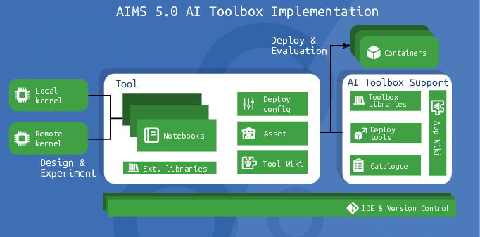

# AIMS5.0 AI Toolbox

If you are searching for the available applications and tools for the AIMS 5.0 AI Toolbox, see [https://github.com/hollosigergely/app-catalogue](https://github.com/hollosigergely/app-catalogue). 

## Introduction
The AIMS 5.0 AI Toolbox is a concept for giving new ways of fast prototyping of AI-based models and libraries. By incorporating solid best practices and recommendations, the toolbox provides a structured framework for industrial users to harness the power of AI effectively. To understand the concept of the AI Toolbox, please read the [paper](doc/NOMS2024.pdf).

The AI Toolbox implementation consist of several recommended parts, as depicted in the figure bellow:


### AI Toolbox Support
The AI Toolbox Support provides means and utils to develop easily deployable AI tools by enabling the developer to experiment with AI algorithms in widely used Jupyter notebooks capable of fast and seamless deployment. The AI Toolbox Support consists of

 * the aitutil utility for easy deployment
 * the [support library](https://github.com/hollosigergely/aitoolbox_support_library) for notebooks to provide polymorphism in deployment
 * the [tool catalogue](https://github.com/hollosigergely/app-catalogue) to enable users to select the right tool for the job


### AI Tools
For selecting the right tool for your problem, see the [tool catalogue](https://github.com/hollosigergely/app-catalogue). To get a glimpse of the internals of a tool, see the [demo tool](https://github.com/hollosigergely/demo-tool). For an introduction of tool development, see the [tool manual](doc/tools.md).

## Usage
The AI Toolbox can be installed using the Visual Code IDE, or using command line only. For the Visual Code extension, see [the AI Toolbox VSCode extension](). Apart from the extension, AI Toolbox can be used in any environment, but Visual Code is prefered in various ways:

 * has good Jupyter notebook support
 * has support for Python and virtual environments
 * has support for remote execution for GPU intensive tasks
 * has support for Git version control

To install using command line, it is prefered to have a virtual environment. Please ensure, that at least a Python 3.8 interpreter and pip is installed on your system. Create a virtual environment:
```
mkdir ~/aitools
python3 -m venv ~/aitools/.venv
source ~/aitools/.venv/bin/activate
```

After that, install the AI Toolbox library and the support library:
```
pip3 install git+https://github.com/hollosigergely/aitoolbox.git
pip3 install git+https://github.com/hollosigergely/aitoolbox_support_library.git
```

Now, AI Toolbox is installed, and you can start using the [aitutil](doc/aitutil.md) tool, or browse the [tool catalogue](https://github.com/hollosigergely/app-catalogue). Also, try the 
[demo tool](https://github.com/hollosigergely/demo-tool), which provide a skeleton for developing tools.

## Citation
To cite the AIMS 5.0 AI Toolbox, please cite the paper as
```
@INPROCEEDINGS{10327821,
  author={Ficzere, Dániel and Hollósi, Gergely and Frankó, Attila and Varga, Pál},
  booktitle={2023 19th International Conference on Network and Service Management (CNSM)}, 
  title={AI Toolbox Concept for the Arrowhead Framework}, 
  year={2023},
  volume={},
  number={},
  pages={1-7},
  doi={10.23919/CNSM59352.2023.10327821}}

```
